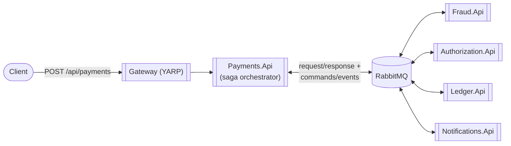

# PayFlow

A payment gateway built as a microservices platform: saga-orchestrated authorization and capture, a
double-entry ledger, fraud review, and merchant notifications — with the failure modes that come
with distributed systems treated as first-class design concerns rather than afterthoughts.

This is a portfolio project, built in phases, each one a working, runnable increment. **Phases 0–2**
(vertical slice → saga orchestration) are implemented today; the phases after that are the roadmap.

## Why this exists

Most "payment demo" repos are a CRUD API with a `status` column. This one is trying to be honest
about what a real payment gateway has to get right: money can't be double-charged or lost between
two service calls, a saga has to survive a crash mid-flow with a compensating transaction when it
needs one, a ledger has to balance by construction, and a design's failure modes should be
documented on purpose, not discovered in an incident.

Where a decision matters and could plausibly have gone another way, it's written down in
[`docs/adr/`](docs/adr/) — including the parts that were *deliberately* incomplete for a phase and
what fixed them later (see [ADR-0002](docs/adr/0002-synchronous-orchestration-before-saga.md) →
[ADR-0005](docs/adr/0005-saga-orchestration-and-outbox.md)).

## Architecture (Phase 2)



Full diagrams (container view, sequence diagram, bounded contexts) are in
[`docs/architecture.md`](docs/architecture.md).

**Stack:** .NET 10 / ASP.NET Core minimal APIs, Clean Architecture per service (Domain → Application
→ Infrastructure → Api), MediatR for CQRS, EF Core + PostgreSQL (database-per-service), MassTransit
+ RabbitMQ for messaging, YARP as the API gateway.

**Patterns demonstrated:**
- **Saga orchestration with a transactional outbox** (the flagship pattern) — a MassTransit state
  machine drives Fraud → Authorization → Ledger with a compensating `VoidAuthorization` transaction
  when Ledger posting fails after authorization already succeeded. See
  [ADR-0005](docs/adr/0005-saga-orchestration-and-outbox.md).
- **A synchronous facade over the async saga** — `POST /payments` still blocks and returns the
  final status for the common (fast) case, via a request/response bridge, with a `202` + polling
  fallback if the saga is still running. See [ADR-0006](docs/adr/0006-synchronous-facade-over-async-saga.md).
- Idempotency keys with a database-enforced unique constraint as the actual dedup guarantee (not
  just a check-then-act race), on both the idempotency-record table and the `Payment` table itself
  — the latter is what makes a retry against an in-flight attempt safe instead of starting a second
  authorization.
- Idempotent-receiver consumers in every service (Fraud, Authorization, Ledger, Notifications), so
  at-least-once message delivery can't double-charge, double-post, or double-notify.
- A double-entry ledger where balances are *derived*, never stored — see
  [ADR-0003](docs/adr/0003-derived-ledger-balances.md).
- A `Result<T>` railway-oriented outcome type so expected business failures (declined charge,
  invalid amount) are part of the domain's vocabulary, not exception-driven control flow.

## Running it

**Prerequisites:** .NET 10 SDK, Docker Desktop.

```bash
docker compose -f deploy/docker-compose/docker-compose.yml up --build
```

This brings up RabbitMQ, five Postgres instances, and six services: `gateway` (`:8080`),
`payments-api` (`:5218`), `authorization-api` (`:5081`), `ledger-api` (`:5204`), `fraud-api`
(`:5277`), `notifications-api` (`:5229`). Each service applies its own EF Core migrations on
startup, so there's nothing else to set up. RabbitMQ's management UI is at
`http://localhost:15672` (guest/guest) — useful for watching the exchanges/queues the saga creates.

### Demo walkthrough

```bash
# 1. Submit a payment (idempotency key required). The saga runs fraud check -> authorize ->
#    ledger post over RabbitMQ, but POST /payments still blocks and returns the final result:
curl -s -X POST http://localhost:8080/api/payments \
  -H "Content-Type: application/json" \
  -H "Idempotency-Key: demo-key-1" \
  -d '{"merchantId":"acme","amount":42.50,"currency":"USD","paymentMethodRef":"tok_visa"}' | jq

# 2. Replay the exact same request — same key, same body — and get the same result back,
#    no double charge, no second authorization:
curl -s -X POST http://localhost:8080/api/payments \
  -H "Content-Type: application/json" \
  -H "Idempotency-Key: demo-key-1" \
  -d '{"merchantId":"acme","amount":42.50,"currency":"USD","paymentMethodRef":"tok_visa"}' | jq

# 3. Check the merchant's ledger balance — it only reflects the one captured payment:
curl -s http://localhost:8080/api/ledger/accounts/merchant:acme/balance | jq

# 4. Force a decline with the magic test token (mirrors how Stripe's test mode works):
curl -s -X POST http://localhost:8080/api/payments \
  -H "Content-Type: application/json" \
  -H "Idempotency-Key: demo-key-2" \
  -d '{"merchantId":"acme","amount":10,"currency":"USD","paymentMethodRef":"tok_declined"}' | jq

# 5. Force a fraud rejection with its own magic token (blocked before authorization is ever called):
curl -s -X POST http://localhost:8080/api/payments \
  -H "Content-Type: application/json" \
  -H "Idempotency-Key: demo-key-3" \
  -d '{"merchantId":"acme","amount":10,"currency":"USD","paymentMethodRef":"tok_fraud"}' | jq

# 6. Prove the merchant was notified for each terminal outcome above:
curl -s "http://localhost:8080/api/notifications?merchantId=acme" | jq
```

A payment's `PaymentId` from any response above can also be checked directly —
`GET /api/payments/{id}` — which doubles as the polling endpoint if a request ever takes long
enough to get a `202 Accepted` instead of a `201` (see ADR-0006).

Swagger UI is available per service in `Development` (the docker-compose default) at
`http://localhost:<port>/swagger`.

### Local development without Docker

```bash
dotnet restore Payflow.slnx
dotnet build Payflow.slnx
dotnet test Payflow.slnx
```

Running services directly with `dotnet run` needs Postgres and RabbitMQ reachable at the
connection strings/settings in each service's `appsettings.json` (defaults assume `localhost`).

## Roadmap

Each phase after Phase 1 ships as its own working increment.

| Phase | Focus |
|---|---|
| 0 – done | Solution scaffolding, Clean Architecture layout, CI skeleton |
| 1 – done | Vertical slice: synchronous HTTP flow, idempotency, double-entry ledger, unit tests |
| 2 – done | Saga orchestration (MassTransit) + transactional outbox; Fraud and Notifications join the flow; compensating transactions |
| 3 | Resilience engineering: Polly circuit breakers/retries, chaos-fault injection (Simmy) |
| 4 | Observability: OpenTelemetry tracing/metrics, structured logs, local Grafana/Prometheus/Tempo/Loki |
| 5 | Kubernetes + Helm, deployed locally via `kind` |
| 6 | Security: Keycloak OIDC, JWT auth, mock tokenization vault |
| 7 | Testcontainers integration tests, NBomber load tests, chaos test suite |
| 8 | README/diagram polish, demo recording |

See [`docs/architecture.md`](docs/architecture.md) for details and [`docs/adr/`](docs/adr/) for the
reasoning behind what's built so far.

## Repository layout

```
src/
  Gateway/Payflow.Gateway/                YARP reverse proxy
  Services/{Payments,Authorization,Ledger,Fraud,Notifications}/
    Payflow.<Service>.Domain/             Entities, value objects, invariants — no framework deps
    Payflow.<Service>.Application/        MediatR commands/queries, ports (interfaces); the saga
                                           state machine lives in Payments.Application/Saga/
    Payflow.<Service>.Infrastructure/     EF Core (+ MassTransit outbox) — implements the ports
    Payflow.<Service>.Api/                Minimal API endpoints, MassTransit consumers, composition root
  Shared/
    Payflow.Shared.Kernel/                Entity, AggregateRoot, ValueObject, Result, Money
    Payflow.Shared.Contracts/             Cross-service HTTP DTOs and bus message contracts
    Payflow.Shared.Api/                   Result-to-HTTP mapping, global exception handling
tests/UnitTests/                          xUnit + FluentAssertions + NSubstitute + MassTransit ITestHarness
deploy/docker-compose/                    Local multi-service orchestration (RabbitMQ + 5 Postgres + 6 services)
docs/                                     Architecture notes and ADRs
```
