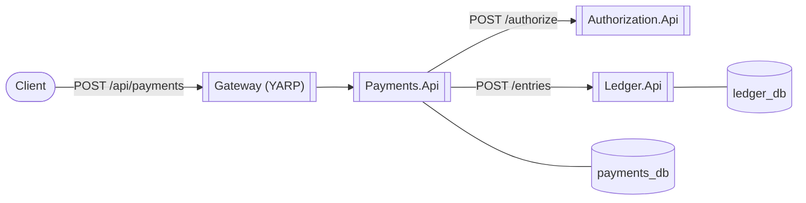

# PayFlow

A payment gateway built as a microservices platform: authorization, double-entry ledger, and
orchestration across service boundaries, with the failure modes that come with distributed systems
treated as first-class design concerns rather than afterthoughts.

This is a portfolio project, built in phases, each one a working, runnable increment. **Phase 1**
(a synchronous vertical slice) is what's implemented today; the phases after it are the roadmap.

## Why this exists

Most "payment demo" repos are a CRUD API with a `status` column. This one is trying to be honest
about what a real payment gateway has to get right: money can't be double-charged or lost between
two service calls, a ledger has to balance by construction, and a design's failure modes should be
documented on purpose, not discovered in an incident.

Where a decision matters and could plausibly have gone another way, it's written down in
[`docs/adr/`](docs/adr/) — including the *deliberately incomplete* parts (see
[ADR-0002](docs/adr/0002-synchronous-orchestration-before-saga.md)).

## Architecture (Phase 1)



Full diagrams (container view, sequence diagram, bounded contexts) are in
[`docs/architecture.md`](docs/architecture.md).

**Stack:** .NET 10 / ASP.NET Core minimal APIs, Clean Architecture per service (Domain → Application
→ Infrastructure → Api), MediatR for CQRS, EF Core + PostgreSQL (database-per-service), YARP as the
API gateway.

**Patterns demonstrated in Phase 1:**
- Idempotency keys with a database-enforced unique constraint as the actual dedup guarantee (not
  just a check-then-act race) — see `SubmitPaymentCommandHandler` and `EfUnitOfWork`.
- Idempotent-receiver endpoints in Authorization and Ledger, so an at-least-once retry from
  Payments can't double-authorize or double-post money.
- A double-entry ledger where balances are *derived*, never stored — see
  [ADR-0003](docs/adr/0003-derived-ledger-balances.md).
- A `Result<T>` railway-oriented outcome type so expected business failures (declined charge,
  invalid amount) are part of the domain's vocabulary, not exception-driven control flow.

## Running it

**Prerequisites:** .NET 10 SDK, Docker Desktop.

```bash
docker compose -f deploy/docker-compose/docker-compose.yml up --build
```

This brings up two Postgres instances and four services: `gateway` (`:8080`), `payments-api`
(`:5218`), `authorization-api` (`:5081`), `ledger-api` (`:5204`). Each service applies its own EF
Core migrations on startup, so there's nothing else to set up.

### Demo walkthrough

```bash
# 1. Submit a payment (idempotency key required)
curl -s -X POST http://localhost:8080/api/payments \
  -H "Content-Type: application/json" \
  -H "Idempotency-Key: demo-key-1" \
  -d '{"merchantId":"acme","amount":42.50,"currency":"USD","paymentMethodRef":"tok_visa"}' | jq

# 2. Replay the exact same request — same key, same body — and get the same result back,
#    no double charge, no second authorization:
curl -s -X POST http://localhost:8080/api/payments \
  -H "Content-Type: application/json" \
  -H "Idempotency-Key: demo-key-1" \
  -d '{"merchantId":"acme","amount":42.50,"currency":"USD","paymentMethodRef":"tok_visa"}' | jq

# 3. Check the merchant's ledger balance — it only reflects the one captured payment:
curl -s http://localhost:8080/api/ledger/accounts/merchant:acme/balance | jq

# 4. Force a decline with the magic test token (mirrors how Stripe's test mode works):
curl -s -X POST http://localhost:8080/api/payments \
  -H "Content-Type: application/json" \
  -H "Idempotency-Key: demo-key-2" \
  -d '{"merchantId":"acme","amount":10,"currency":"USD","paymentMethodRef":"tok_declined"}' | jq
```

Swagger UI is available per service in `Development` (the docker-compose default) at
`http://localhost:<port>/swagger`.

### Local development without Docker

```bash
dotnet restore Payflow.slnx
dotnet build Payflow.slnx
dotnet test Payflow.slnx
```

Running services directly with `dotnet run` needs Postgres reachable at the connection strings in
each service's `appsettings.json` (defaults assume `localhost:5432` / `:5433`).

## Roadmap

Each phase after Phase 1 ships as its own working increment.

| Phase | Focus |
|---|---|
| 0 – done | Solution scaffolding, Clean Architecture layout, CI skeleton |
| 1 – done | Vertical slice: synchronous HTTP flow, idempotency, double-entry ledger, unit tests |
| 2 | Saga orchestration (MassTransit) + transactional outbox; Fraud and Notifications services join the flow |
| 3 | Resilience engineering: Polly circuit breakers/retries, chaos-fault injection (Simmy) |
| 4 | Observability: OpenTelemetry tracing/metrics, structured logs, local Grafana/Prometheus/Tempo/Loki |
| 5 | Kubernetes + Helm, deployed locally via `kind` |
| 6 | Security: Keycloak OIDC, JWT auth, mock tokenization vault |
| 7 | Testcontainers integration tests, NBomber load tests, chaos test suite |
| 8 | README/diagram polish, demo recording |

See [`docs/architecture.md`](docs/architecture.md) for details and [`docs/adr/`](docs/adr/) for the
reasoning behind what's built so far.

## Repository layout

```
src/
  Gateway/Payflow.Gateway/                YARP reverse proxy
  Services/{Payments,Authorization,Ledger}/
    Payflow.<Service>.Domain/             Entities, value objects, invariants — no framework deps
    Payflow.<Service>.Application/        MediatR commands/queries, ports (interfaces)
    Payflow.<Service>.Infrastructure/     EF Core, HTTP clients — implements the ports
    Payflow.<Service>.Api/                Minimal API endpoints, composition root
  Shared/
    Payflow.Shared.Kernel/                Entity, AggregateRoot, ValueObject, Result, Money
    Payflow.Shared.Contracts/             Cross-service request/response DTOs
    Payflow.Shared.Api/                   Result-to-HTTP mapping, global exception handling
tests/UnitTests/                          xUnit + FluentAssertions + NSubstitute
deploy/docker-compose/                    Local multi-service orchestration
docs/                                     Architecture notes and ADRs
```
