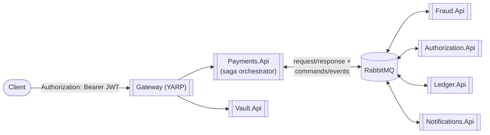

# PayFlow

[](https://github.com/queennduji/payflow/actions/workflows/ci.yml)
[](LICENSE)

A payment gateway built as a microservices platform: saga-orchestrated authorization and capture, a
double-entry ledger, fraud review, and merchant notifications — with the failure modes that come
with distributed systems treated as first-class design concerns rather than afterthoughts.

This is a portfolio project, built in phases, each one a working, runnable increment. **Phases 0–7**
(vertical slice → saga orchestration → resilience engineering → observability → Kubernetes/Helm →
security → testing depth) are implemented today; the phases after that are the roadmap.

## Why this exists

Most "payment demo" repos are a CRUD API with a `status` column. This one is trying to be honest
about what a real payment gateway has to get right: money can't be double-charged or lost between
two service calls, a saga has to survive a crash mid-flow with a compensating transaction when it
needs one, a ledger has to balance by construction, and a design's failure modes should be
documented on purpose, not discovered in an incident.

Where a decision matters and could plausibly have gone another way, it's written down in
[`docs/adr/`](docs/adr/) — including the parts that were *deliberately* incomplete for a phase and
what fixed them later (see [ADR-0002](docs/adr/0002-synchronous-orchestration-before-saga.md) →
[ADR-0005](docs/adr/0005-saga-orchestration-and-outbox.md)).

## Architecture



The gateway and every service behind it validate that JWT independently against Keycloak — see
[ADR-0009](docs/adr/0009-tokenization-boundary-and-zero-trust-auth.md). Not pictured here to keep
this at-a-glance: Keycloak itself and the observability stack (OTel Collector → Tempo/Loki/Prometheus,
Grafana) sitting alongside all of the above. Full diagrams (container view including both, sequence
diagram, bounded contexts) are in [`docs/architecture.md`](docs/architecture.md).

**Stack:** .NET 10 / ASP.NET Core minimal APIs, Clean Architecture per service (Domain → Application
→ Infrastructure → Api), MediatR for CQRS, EF Core + PostgreSQL (database-per-service), MassTransit
+ RabbitMQ for messaging, YARP as the API gateway.

**Patterns demonstrated:**
- **Saga orchestration with a transactional outbox** (the flagship pattern) — a MassTransit state
  machine drives Fraud → Authorization → Ledger with a compensating `VoidAuthorization` transaction
  when Ledger posting fails after authorization already succeeded. See
  [ADR-0005](docs/adr/0005-saga-orchestration-and-outbox.md).
- **A synchronous facade over the async saga** — `POST /payments` still blocks and returns the
  final status for the common (fast) case, via a request/response bridge, with a `202` + polling
  fallback if the saga is still running. See [ADR-0006](docs/adr/0006-synchronous-facade-over-async-saga.md).
- Idempotency keys with a database-enforced unique constraint as the actual dedup guarantee (not
  just a check-then-act race), on both the idempotency-record table and the `Payment` table itself
  — the latter is what makes a retry against an in-flight attempt safe instead of starting a second
  authorization.
- Idempotent-receiver consumers in every service (Fraud, Authorization, Ledger, Notifications), so
  at-least-once message delivery can't double-charge, double-post, or double-notify.
- A double-entry ledger where balances are *derived*, never stored — see
  [ADR-0003](docs/adr/0003-derived-ledger-balances.md).
- A `Result<T>` railway-oriented outcome type so expected business failures (declined charge,
  invalid amount) are part of the domain's vocabulary, not exception-driven control flow.
- **Resilience policy around the (simulated) card network** — timeout, retry with exponential
  backoff, and a circuit breaker (Polly v8), with a configurable fault-injection rate so the whole
  chain is actually exercisable, not just present. Exhausted retries or an open circuit degrade to
  an ordinary `processor_unavailable` decline rather than a fault.
- **Distributed tracing, metrics, and structured logs, correlated** — every service ships OTLP to a
  collector that fans out to Tempo, Prometheus, and Loki, with trace/span IDs stamped on every log
  line so a span and its logs can be found from each other in Grafana. See
  [ADR-0007](docs/adr/0007-otel-collector-as-telemetry-fan-out.md).
- **The same platform as one Helm chart**, deployable to a local `kind` cluster — see
  [`docs/kubernetes.md`](docs/kubernetes.md).
- **A tokenization boundary and zero-trust internal auth** — a small Vault service is the only place
  a card number is ever accepted, and every service (not just the gateway) validates its own
  Keycloak-issued JWT. See [ADR-0009](docs/adr/0009-tokenization-boundary-and-zero-trust-auth.md).
- **Integration tests against real infrastructure, not mocks** — the saga's happy/decline/fraud
  paths, JWT validation, and Phase 3's fault-injection knob all get exercised through real,
  disposable Postgres/RabbitMQ/Keycloak containers via Testcontainers, alongside an NBomber load
  test that drives the same demo flow at sustained throughput against a running stack.

## Running it

**Prerequisites:** .NET 10 SDK, Docker Desktop.

```bash
cp deploy/docker-compose/.env.example deploy/docker-compose/.env
docker compose -f deploy/docker-compose/docker-compose.yml up --build
```

`.env` (gitignored) holds the local Postgres/Grafana/Keycloak admin passwords — containers on your
own machine's Docker network, never exposed anywhere, so the placeholder value in `.env.example` is
fine as-is.

This brings up RabbitMQ, Keycloak (`:8081`), six Postgres instances, seven services — `gateway`
(`:8080`), `payments-api` (`:5218`), `authorization-api` (`:5081`), `ledger-api` (`:5204`),
`fraud-api` (`:5277`), `notifications-api` (`:5229`), `vault-api` (`:5438`) — and the observability
stack: an OpenTelemetry Collector, Tempo, Loki, Prometheus, and Grafana (`:3000`). Each service
applies its own EF Core migrations on startup, and Keycloak imports its realm on first boot, so
there's nothing else to set up. RabbitMQ's management UI is at `http://localhost:15672`
(guest/guest) — useful for watching the exchanges/queues the saga creates.

### Demo walkthrough

Every endpoint below requires a valid JWT (see [ADR-0009](docs/adr/0009-tokenization-boundary-and-zero-trust-auth.md)).
Fetch one from Keycloak first — it's good for a while, so grab it once per shell session:

```bash
TOKEN=$(curl -s -X POST http://localhost:8081/realms/payflow/protocol/openid-connect/token \
  -H "Content-Type: application/x-www-form-urlencoded" \
  -d "grant_type=password&client_id=payflow-client&username=demo-merchant&password=demo-merchant" \
  | jq -r .access_token)
```

```bash
# 0. Tokenize a card via the Vault — the full number is accepted here and nowhere else; every
#    downstream call only ever sees the token it returns:
curl -s -X POST http://localhost:8080/api/vault/tokenize \
  -H "Content-Type: application/json" -H "Authorization: Bearer $TOKEN" \
  -d '{"cardNumber":"4242424242424242","expiryMonth":12,"expiryYear":2030}' | jq

# 1. Submit a payment (idempotency key required). The saga runs fraud check -> authorize ->
#    ledger post over RabbitMQ, but POST /payments still blocks and returns the final result:
curl -s -X POST http://localhost:8080/api/payments \
  -H "Content-Type: application/json" -H "Authorization: Bearer $TOKEN" \
  -H "Idempotency-Key: demo-key-1" \
  -d '{"merchantId":"acme","amount":42.50,"currency":"USD","paymentMethodRef":"tok_visa"}' | jq

# 2. Replay the exact same request — same key, same body — and get the same result back,
#    no double charge, no second authorization:
curl -s -X POST http://localhost:8080/api/payments \
  -H "Content-Type: application/json" -H "Authorization: Bearer $TOKEN" \
  -H "Idempotency-Key: demo-key-1" \
  -d '{"merchantId":"acme","amount":42.50,"currency":"USD","paymentMethodRef":"tok_visa"}' | jq

# 3. Check the merchant's ledger balance — it only reflects the one captured payment:
curl -s -H "Authorization: Bearer $TOKEN" http://localhost:8080/api/ledger/accounts/merchant:acme/balance | jq

# 4. Force a decline with the magic test token (mirrors how Stripe's test mode works):
curl -s -X POST http://localhost:8080/api/payments \
  -H "Content-Type: application/json" -H "Authorization: Bearer $TOKEN" \
  -H "Idempotency-Key: demo-key-2" \
  -d '{"merchantId":"acme","amount":10,"currency":"USD","paymentMethodRef":"tok_declined"}' | jq

# 5. Force a fraud rejection with its own magic token (blocked before authorization is ever called):
curl -s -X POST http://localhost:8080/api/payments \
  -H "Content-Type: application/json" -H "Authorization: Bearer $TOKEN" \
  -H "Idempotency-Key: demo-key-3" \
  -d '{"merchantId":"acme","amount":10,"currency":"USD","paymentMethodRef":"tok_fraud"}' | jq

# 6. Prove the merchant was notified for each terminal outcome above:
curl -s -H "Authorization: Bearer $TOKEN" "http://localhost:8080/api/notifications?merchantId=acme" | jq

# 7. Without a token, every one of the above now fails — the boundary is real, not decorative:
curl -s -o /dev/null -w "%{http_code}\n" -X POST http://localhost:8080/api/payments \
  -H "Content-Type: application/json" -H "Idempotency-Key: no-token" \
  -d '{"merchantId":"acme","amount":10,"currency":"USD","paymentMethodRef":"tok_visa"}'
```

A payment's `PaymentId` from any response above can also be checked directly —
`GET /api/payments/{id}` — which doubles as the polling endpoint if a request ever takes long
enough to get a `202 Accepted` instead of a `201` (see ADR-0006).

Swagger UI is available per service in `Development` (the docker-compose default) at
`http://localhost:<port>/swagger`.

### Watching the circuit breaker trip

The mock card network fails outright some fraction of the time, controlled by
`Chaos__CardNetworkFaultRate` on `authorization-api` (default `0.0`, i.e. off). Crank it up and
watch the resilience policy — timeout → retry → circuit breaker — actually do something:

```bash
# Edit deploy/docker-compose/docker-compose.yml: set Chaos__CardNetworkFaultRate to "0.6" under
# authorization-api, then:
docker compose -f deploy/docker-compose/docker-compose.yml up --build -d authorization-api

# Fire a burst of payments and watch the mix of outcomes:
for i in $(seq 1 15); do
  curl -s -X POST http://localhost:8080/api/payments \
    -H "Content-Type: application/json" -H "Authorization: Bearer $TOKEN" -H "Idempotency-Key: chaos-$i" \
    -d '{"merchantId":"chaos","amount":10,"currency":"USD","paymentMethodRef":"tok_visa"}' | jq -c '{status,failureReason}'
done
```

Expect a mix of normal `Captured` results, a few that succeeded after a retry, and — once enough
failures land inside the sampling window — a run of fast `Declined` / `processor_unavailable`
responses while the circuit is open, then recovery once the break duration elapses. Set the rate
back to `0.0` (or just restart the container) to return to normal.

### Watching a payment's trace, metrics, and logs

`docker compose up` also brings up an OpenTelemetry Collector, Tempo, Loki, and Prometheus, with
Grafana wired to all three. Run the demo `curl` sequence above, then:

1. Open Grafana at `http://localhost:3000` (`admin` / whatever `GRAFANA_ADMIN_PASSWORD` resolved to
   in your `.env`) and go to **Explore**.
2. Pick the **Tempo** datasource and search for a recent trace — a payment's spans show up across
   `gateway` → `payments-api` → (over the bus) `fraud-api` / `authorization-api` / `ledger-api` →
   `notifications-api`, in one place.
3. Click a span, then "Logs for this span" to jump straight to its correlated lines in Loki.
4. The **PayFlow Overview** dashboard (provisioned automatically, under the PayFlow folder) plots
   payment outcomes and request latency live as you fire more `curl` requests.

Cranking `Chaos__CardNetworkFaultRate` back up (previous section) is a good way to see retries and
an open circuit breaker show up as span events and log lines, not just inferred from response codes.

### Local development without Docker

```bash
dotnet restore Payflow.slnx
dotnet build Payflow.slnx
dotnet test Payflow.slnx
```

Running services directly with `dotnet run` needs Postgres and RabbitMQ reachable at the
connection strings/settings in each service's `appsettings.json` (defaults assume `localhost`,
matching the Postgres containers from `docker compose up` and the `.env.example` password — edit
both `appsettings.json` and `.env` together if you change it).

`dotnet test` needs Docker Desktop running even without `docker compose up` — the integration
tests under `tests/IntegrationTests/` spin up real, disposable Postgres/RabbitMQ/Keycloak
containers via [Testcontainers](https://testcontainers.com/), the same way the real deployment
uses them, rather than mocking any of the three.

### Load testing

```bash
docker compose -f deploy/docker-compose/docker-compose.yml up --build  # if not already running
dotnet run --project tests/LoadTests/Payflow.LoadTests -c Release
```

Fetches a real token the same way the demo does, then drives sustained load at `POST /payments`
against that running stack, producing an HTML+CSV report under `reports/`. Cranking
`Chaos__CardNetworkFaultRate` first (see above) is the documented way to run it a second time
under chaos — watch Grafana's dashboard move in real time either way.

## Roadmap

Each phase after Phase 1 ships as its own working increment.

| Phase | Focus |
|---|---|
| 0 – done | Solution scaffolding, Clean Architecture layout, CI skeleton |
| 1 – done | Vertical slice: synchronous HTTP flow, idempotency, double-entry ledger, unit tests |
| 2 – done | Saga orchestration (MassTransit) + transactional outbox; Fraud and Notifications join the flow; compensating transactions |
| 3 – done | Resilience engineering: Polly v8 timeout/retry/circuit breaker around the mock card network, configurable fault injection, EF Core connection resiliency |
| 4 – done | Observability: OpenTelemetry tracing/metrics, Serilog structured logs, local Grafana/Prometheus/Tempo/Loki |
| 5 – done | Kubernetes + Helm, deployed locally via `kind` |
| 6 – done | Security: Keycloak OIDC, JWT auth, mock tokenization vault |
| 7 – done | Testcontainers integration tests, NBomber load tests, chaos test suite |
| 8 – done | README/architecture-diagram polish, CI badges — demo recording dropped (no screen-capture tooling available) |

See [`docs/architecture.md`](docs/architecture.md) for details and [`docs/adr/`](docs/adr/) for the
reasoning behind what's built so far.

## Repository layout

```
src/
  Gateway/Payflow.Gateway/                YARP reverse proxy
  Services/{Payments,Authorization,Ledger,Fraud,Notifications,Vault}/
    Payflow.<Service>.Domain/             Entities, value objects, invariants — no framework deps
    Payflow.<Service>.Application/        MediatR commands/queries, ports (interfaces); the saga
                                           state machine lives in Payments.Application/Saga/
    Payflow.<Service>.Infrastructure/     EF Core (+ MassTransit outbox where used) — implements the ports
    Payflow.<Service>.Api/                Minimal API endpoints, MassTransit consumers, composition root
  Shared/
    Payflow.Shared.Kernel/                Entity, AggregateRoot, ValueObject, Result, Money
    Payflow.Shared.Contracts/             Cross-service HTTP DTOs and bus message contracts
    Payflow.Shared.Api/                   Result-to-HTTP mapping, global exception handling,
                                           observability + JWT auth wiring
tests/
  UnitTests/                              xUnit + FluentAssertions + NSubstitute + MassTransit ITestHarness
  IntegrationTests/                       Testcontainers-backed Postgres/RabbitMQ/Keycloak, real saga + auth flows
  LoadTests/                              NBomber, run against a live docker-compose stack
deploy/
  docker-compose/                         Local multi-service orchestration (RabbitMQ, Keycloak, 6 Postgres, 7 services)
  keycloak/                               Realm export shared by docker-compose, Helm, and the integration tests
  helm/payflow/                           The same platform as one Helm chart (see docs/kubernetes.md)
  kind/                                   Local kind cluster config + build/load scripts
docs/                                     Architecture notes and ADRs
```
