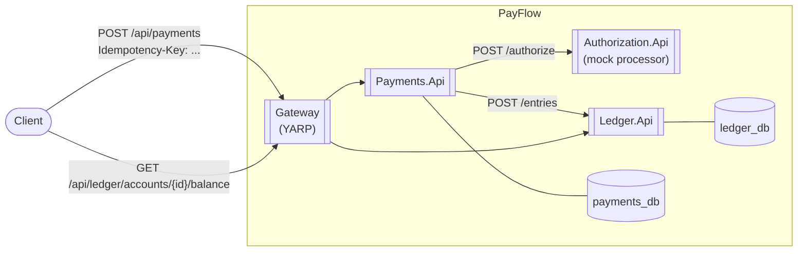
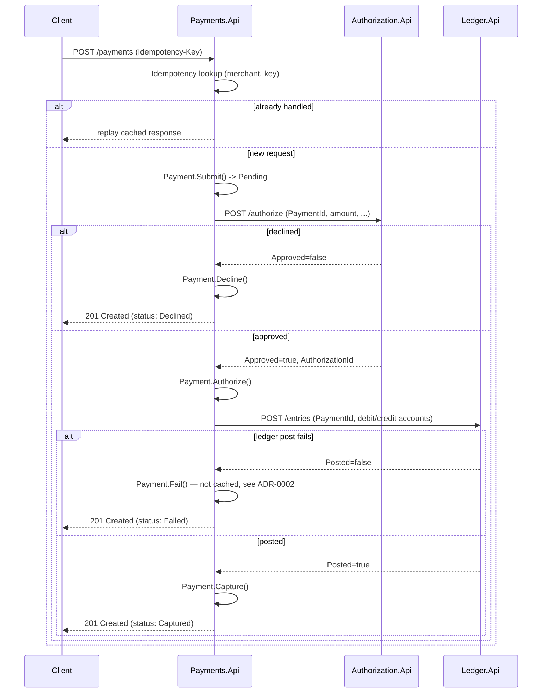

# Architecture

This document tracks the system's shape as it grows phase by phase (see the [README](../README.md)
for the full roadmap). It reflects **Phase 1**: a synchronous vertical slice, intentionally not yet
the saga-based design that Phase 2 introduces — see [ADR-0002](adr/0002-synchronous-orchestration-before-saga.md).

## Container view (Phase 1)

## Request flow: `POST /payments`

## Bounded contexts

| Service | Owns | Notes |
|---|---|---|
| Payments | `Payment` aggregate, idempotency records | Entry point; orchestrates the flow (Phase 1) / hosts the saga (Phase 2) |
| Authorization | Mock authorization decisions | Idempotent per `PaymentId`; in-memory store is a documented Phase-1 simplification |
| Ledger | `Account`, `LedgerEntryGroup` (double-entry) | Balances are always derived, never stored — [ADR-0003](adr/0003-derived-ledger-balances.md) |

Each service follows Clean Architecture layering (`Domain` → `Application` → `Infrastructure` →
`Api`) with MediatR for CQRS inside `Application`. Cross-service DTOs live in
`Payflow.Shared.Contracts`; framework-free domain building blocks (`Entity`, `AggregateRoot`,
`ValueObject`, `Result`, `Money`) live in `Payflow.Shared.Kernel`.

## Roadmap

See the [README](../README.md#roadmap) for the phase-by-phase plan (saga + outbox, resilience
engineering, observability, Kubernetes/Helm, security, load/chaos testing). This document will grow
a diagram per phase as each lands.
