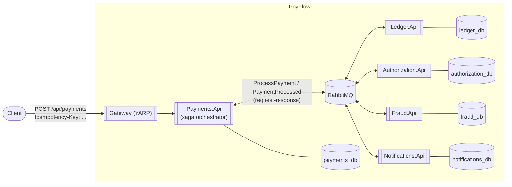

# Architecture

This document tracks the system's shape as it grows phase by phase (see the [README](../README.md)
for the full roadmap). It reflects **Phase 2**: a saga-orchestrated, message-driven flow with a
synchronous facade — see [ADR-0005](adr/0005-saga-orchestration-and-outbox.md) and
[ADR-0006](adr/0006-synchronous-facade-over-async-saga.md). Phase 1's synchronous HTTP chain (still
visible in `docs/adr/0002-*.md`) has been fully replaced, not layered on top of.

## Container view (Phase 2)



Every service that publishes a message does so through MassTransit's transactional outbox — the
message and the database write it depends on commit atomically (ADR-0005).

## Request flow: `POST /payments`

```mermaid
sequenceDiagram
    participant C as Client
    participant P as Payments.Api
    participant Saga as PaymentSagaStateMachine
    participant F as Fraud
    participant A as Authorization
    participant L as Ledger
    participant N as Notifications

    C->>P: POST /payments (Idempotency-Key)
    P->>P: Idempotency lookup; Payment.Submit() -> Pending
    P->>Saga: ProcessPayment (via IRequestClient, 10s bound)
    Saga->>F: CheckFraud
    alt fraud rejects
        F-->>Saga: FraudCheckFailed
        Saga->>P: MarkPaymentDeclinedCommand
        Saga-->>P: PaymentProcessed (Declined)
        Saga->>N: SendPaymentNotification (fire-and-forget)
    else fraud passes
        F-->>Saga: FraudCheckPassed
        Saga->>A: AuthorizePayment
        alt declined
            A-->>Saga: PaymentAuthorizationDeclined
            Saga->>P: MarkPaymentDeclinedCommand
            Saga-->>P: PaymentProcessed (Declined)
        else approved
            A-->>Saga: PaymentAuthorized
            Saga->>P: MarkPaymentAuthorizedCommand
            Saga->>L: PostLedgerEntry
            alt ledger fails
                L-->>Saga: LedgerPostFailed
                Saga->>A: VoidAuthorization (compensating transaction)
                A-->>Saga: AuthorizationVoided
                Saga->>P: MarkPaymentFailedCommand
                Saga-->>P: PaymentProcessed (Failed)
            else posted
                L-->>Saga: LedgerEntryPosted
                Saga->>P: MarkPaymentCapturedCommand
                Saga-->>P: PaymentProcessed (Captured)
            end
        end
        Saga->>N: SendPaymentNotification (fire-and-forget)
    end
    P-->>C: 201 Created (final status) — or 202 Accepted + Location if the 10s bound elapses first
```

## Bounded contexts

| Service | Owns | Notes |
|---|---|---|
| Payments | `Payment` aggregate, idempotency records, the saga's own state | Entry point; hosts `PaymentSagaStateMachine` |
| Fraud | Fraud check audit log, velocity counts | Rule-based: blocklist, amount threshold, rolling-window velocity |
| Authorization | Mock authorization decisions | Now EF-backed and idempotent per `PaymentId` (Phase 1's in-memory version is gone) |
| Ledger | `Account`, `LedgerEntryGroup` (double-entry) | Balances are always derived, never stored — [ADR-0003](adr/0003-derived-ledger-balances.md) |
| Notifications | Simulated webhook delivery log | Fire-and-forget from the saga's perspective — a slow/failed notification never rolls back money |

Each service still follows Clean Architecture layering (`Domain` → `Application` → `Infrastructure`
→ `Api`) with MediatR for CQRS inside `Application`. What changed in Phase 2 is *how* services talk
to each other: point-to-point commands and published events over RabbitMQ (via MassTransit)
instead of direct HTTP calls — the HTTP endpoints on Authorization and Ledger from Phase 1 still
exist for manual inspection, but the saga no longer uses them.

## Roadmap

See the [README](../README.md#roadmap) for the phase-by-phase plan (resilience engineering,
observability, Kubernetes/Helm, security, load/chaos testing). This document will grow a diagram
per phase as each lands.
