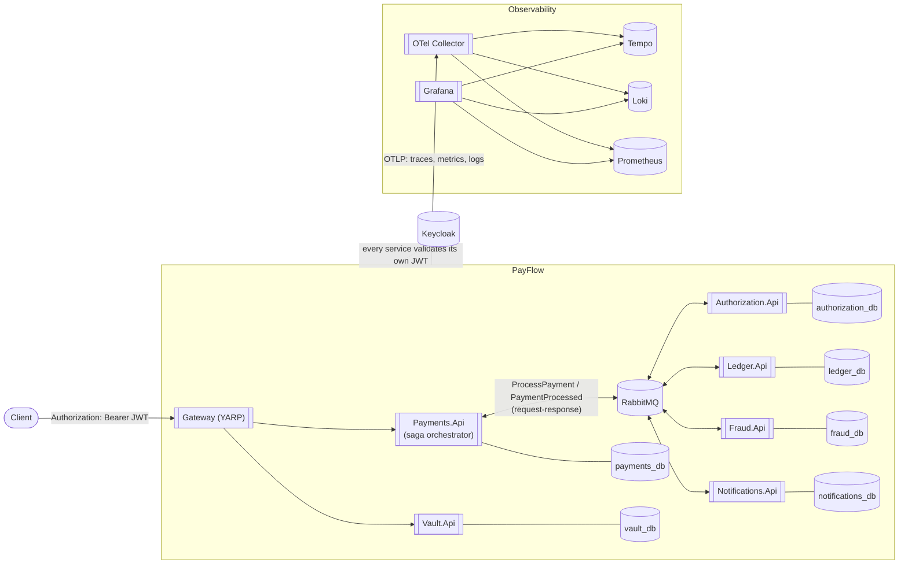

# Architecture

This document reflects the system's current shape (through Phase 7). The phase-by-phase history of
*how* it got here — what each increment added and why — lives in git history and
[`docs/adr/`](adr/), not here; this doc only tracks where things stand today.

## Container view



Every service that publishes a message does so through MassTransit's transactional outbox — the
message and the database write it depends on commit atomically ([ADR-0005](adr/0005-saga-orchestration-and-outbox.md)).
Every service — not just the gateway — validates its own Keycloak-issued JWT independently; the bus
is the internal trust boundary, HTTP is the perimeter ([ADR-0009](adr/0009-tokenization-boundary-and-zero-trust-auth.md)).
Every service also ships OTLP to one collector, which fans traces/metrics/logs out to Tempo,
Prometheus, and Loki respectively ([ADR-0007](adr/0007-otel-collector-as-telemetry-fan-out.md)).

## Request flow: `POST /payments`

The JWT check above happens at the perimeter, before any of this — by the time
`SubmitPaymentCommandHandler` runs, the caller is already authenticated, so it isn't part of the
saga's own sequence below.

```mermaid
sequenceDiagram
    participant C as Client
    participant P as Payments.Api
    participant Saga as PaymentSagaStateMachine
    participant F as Fraud
    participant A as Authorization
    participant L as Ledger
    participant N as Notifications

    C->>P: POST /payments (Idempotency-Key)
    P->>P: Idempotency lookup; Payment.Submit() -> Pending
    P->>Saga: ProcessPayment (via IRequestClient, 10s bound)
    Saga->>F: CheckFraud
    alt fraud rejects
        F-->>Saga: FraudCheckFailed
        Saga->>P: MarkPaymentDeclinedCommand
        Saga-->>P: PaymentProcessed (Declined)
        Saga->>N: SendPaymentNotification (fire-and-forget)
    else fraud passes
        F-->>Saga: FraudCheckPassed
        Saga->>A: AuthorizePayment
        alt declined
            A-->>Saga: PaymentAuthorizationDeclined
            Saga->>P: MarkPaymentDeclinedCommand
            Saga-->>P: PaymentProcessed (Declined)
        else approved
            A-->>Saga: PaymentAuthorized
            Saga->>P: MarkPaymentAuthorizedCommand
            Saga->>L: PostLedgerEntry
            alt ledger fails
                L-->>Saga: LedgerPostFailed
                Saga->>A: VoidAuthorization (compensating transaction)
                A-->>Saga: AuthorizationVoided
                Saga->>P: MarkPaymentFailedCommand
                Saga-->>P: PaymentProcessed (Failed)
            else posted
                L-->>Saga: LedgerEntryPosted
                Saga->>P: MarkPaymentCapturedCommand
                Saga-->>P: PaymentProcessed (Captured)
            end
        end
        Saga->>N: SendPaymentNotification (fire-and-forget)
    end
    P-->>C: 201 Created (final status) — or 202 Accepted + Location if the 10s bound elapses first
```

## Bounded contexts

| Service | Owns | Notes |
|---|---|---|
| Payments | `Payment` aggregate, idempotency records, the saga's own state | Entry point; hosts `PaymentSagaStateMachine` |
| Fraud | Fraud check audit log, velocity counts | Rule-based: blocklist, amount threshold, rolling-window velocity |
| Authorization | Mock authorization decisions | EF-backed, idempotent per `PaymentId`; the mock card network is where Phase 3's timeout/retry/circuit-breaker pipeline sits |
| Ledger | `Account`, `LedgerEntryGroup` (double-entry) | Balances are always derived, never stored — [ADR-0003](adr/0003-derived-ledger-balances.md) |
| Notifications | Simulated webhook delivery log | Fire-and-forget from the saga's perspective — a slow/failed notification never rolls back money |
| Vault | `VaultToken` (token, last-4, expiry) — deliberately nothing else | The only place a full card number is ever accepted; not a saga participant — [ADR-0009](adr/0009-tokenization-boundary-and-zero-trust-auth.md) |

Each service still follows Clean Architecture layering (`Domain` → `Application` → `Infrastructure`
→ `Api`) with MediatR for CQRS inside `Application`. Services talk to *each other* over RabbitMQ
(via MassTransit) — point-to-point commands and published events, never direct HTTP — but every
service also keeps its own directly-reachable HTTP surface (Swagger included) for manual inspection;
the saga itself never uses those, only a person poking at the system does.

## Running it

The same platform, two deployment targets: `docker compose up` (the documented default — see the
[README](../README.md#running-it)) and a local Kubernetes cluster via the Helm chart (see
[`docs/kubernetes.md`](kubernetes.md)). Both run identical images against identical configuration
shapes; neither is a simplified stand-in for the other.

## Roadmap

See the [README](../README.md#roadmap) for the phase-by-phase plan and [`docs/adr/`](adr/) for the
reasoning behind what's built so far.
